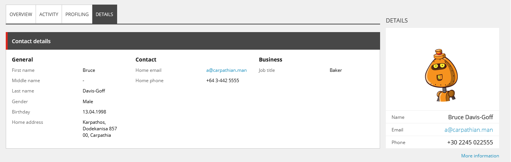

# 🎭 Gravatars in Sitecore Experience Profile

This repository contains code for displaying [Gravatars][1] in the Sitecore
Experience Profile that [Rick Bauer][2] and I demonstrated in our _JavaScript
Services & Marketing Automation_ and _Crank Up Your Sitecore Authoring and
Marketing Experience_ presentations.

## 🏗️ Setup

### 🐳 Docker

1. Build the Sitecore 9.3 docker images using the steps in the
   [Sitecore Docker images repository][3].
2. Build the solution with the `Docker` build configuration.
3. All projects in the solution will be automatically published to Docker on
   build courtesy of [Helix Publishing Pipeline][4].
4. On the command line:
   1. `cd C:\[path-to]\sitecore-improved-page-attribute-controls`
   2. `docker-compose up`

### 💽 Locally

1. Install a new instance of [Sitecore 9.3][5].
2. Update the `publishUrl` in [`PublishSettings.Sitecore.targets`][6] to your
   Sitecore installation's web root (e.g., `C:\inetpub\wwwroot\sc93.sc`).
3. Update the `sourceFolder` in [`CoreyAndRick.Project.Common.Dev.config`][7] to
   point to the root of this repository on your disk.
4. Build the solution with the `Debug` build configuration.
5. All projects in the solution will be automatically published to Sitecore on
   build courtesy of [Helix Publishing Pipeline][4].

[1]: https://www.gravatar.com/
[2]: https://twitter.com/Sitecordial
[3]: https://github.com/sitecore/docker-images
[4]: https://github.com/richardszalay/helix-publishing-pipeline
[5]: https://dev.sitecore.net/Downloads/Sitecore_Experience_Platform/93/Sitecore_Experience_Platform_93_Initial_Release.aspx
[6]: PublishSettings.Sitecore.targets
[7]: src/Project/Common/sitecore/App_Config/Environment/CoreyAndRick.Project.Common.Dev.config
